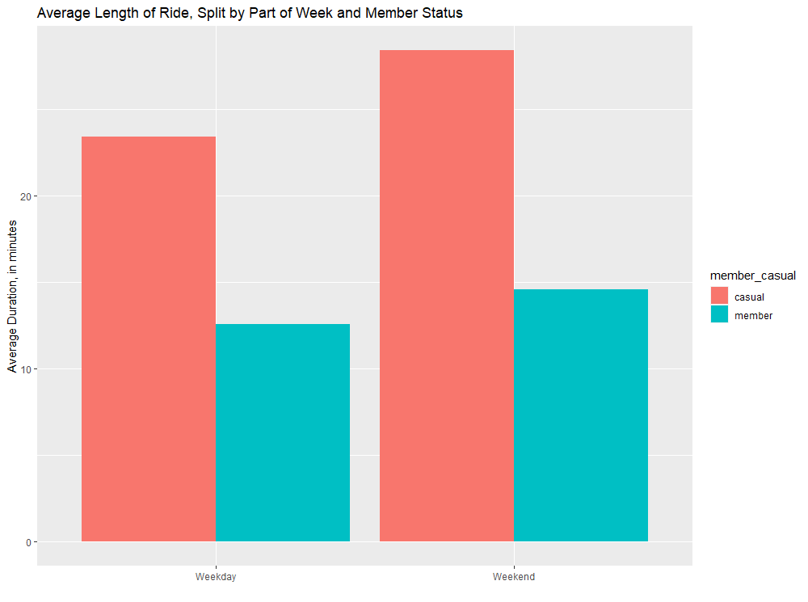
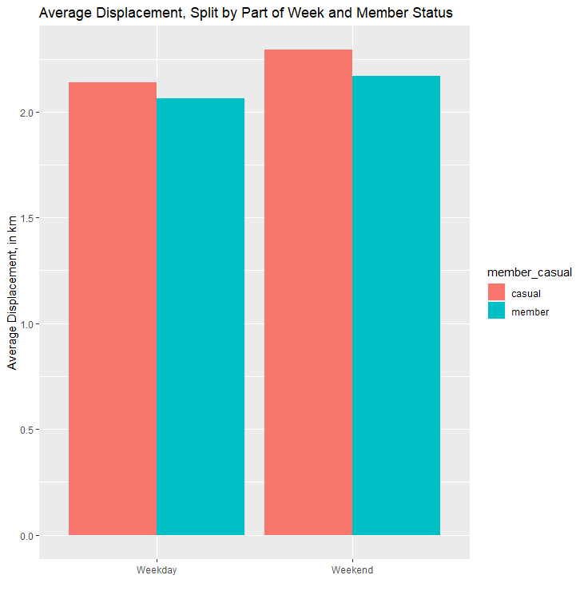
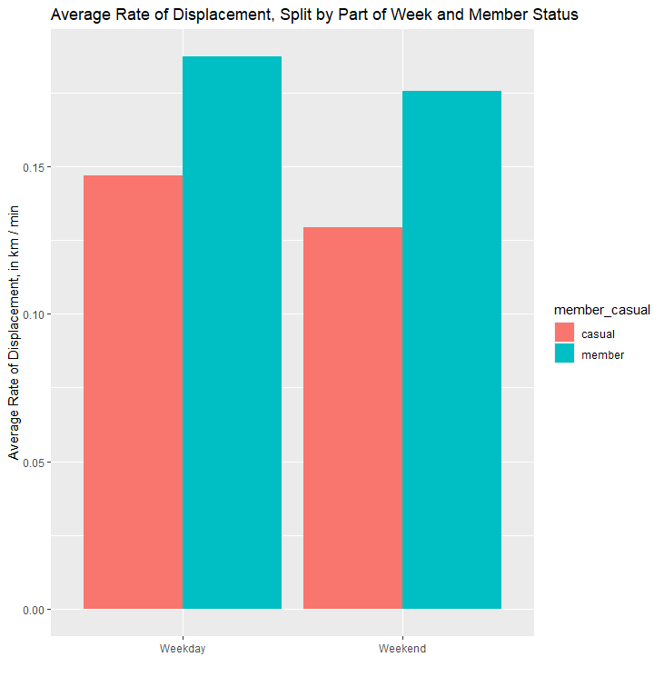
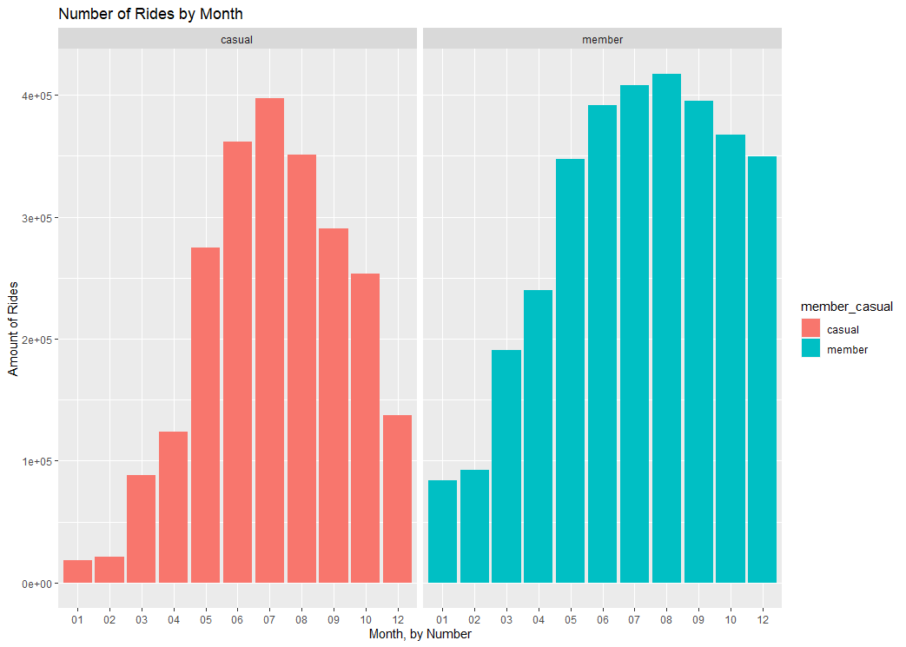
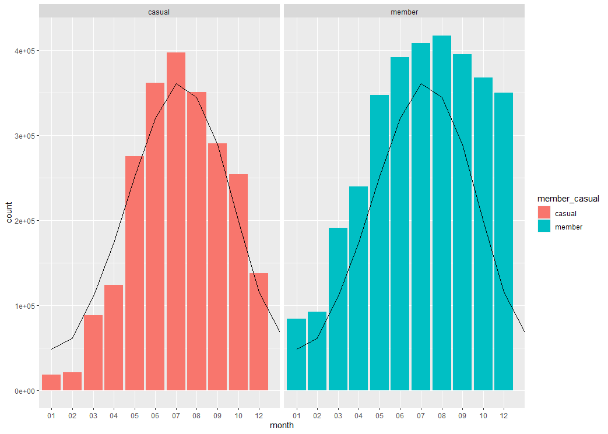
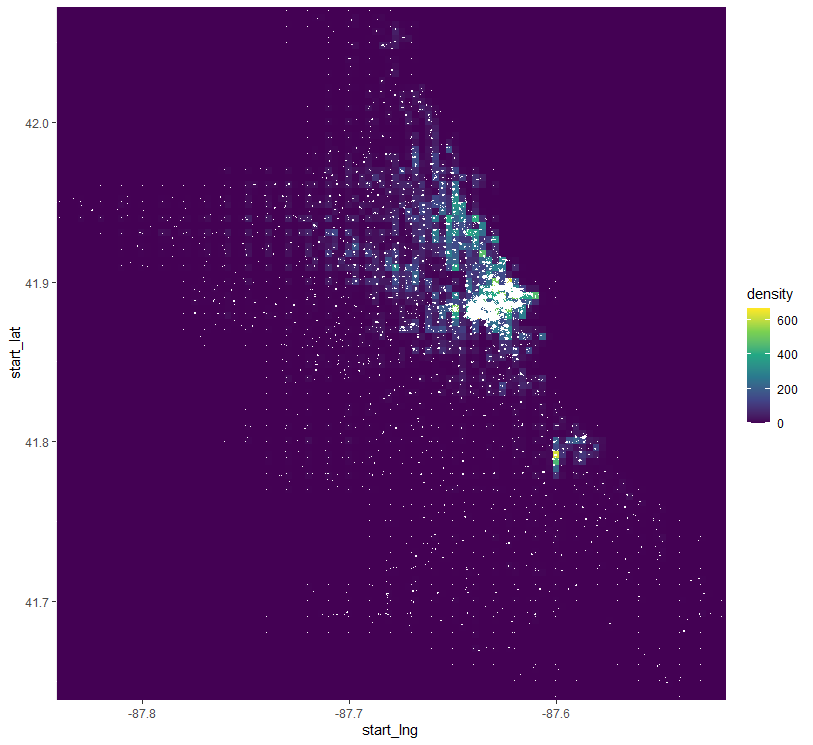

# Case Overview

**Cyclistic** is a bike-sharing service based in Chicago with over 5,000 bikes and over 600 docking stations. Users can unlock a bike from any station and lock it at any station. Users can get single ride passes, day passes, or become members for an annual subscription fee. As member subscriptions are more profitable, Cyclistic wants to convert casual riders (who ride with single or day passes) into members (who ride with subscriptions). How do casual riders and members use the service differently, and how can that inform how Cyclistic should market membership to casual riders?

# Business Task

Cyclistic wants to determine how casual users use bikes differently than members. This information would help Cyclistic design new marketing strategies aimed towards converting casual riders into annual members. For example, if casual riders tend to ride as much as or more often than members, Cyclistic can run campaigns to remind casual users of cost savings of signing up as a member (note: with the data available, it cannot be determined how often one user rides). These insights would be useful to the marketing team as well as benefit the company as a whole by helping to increase profits by increasing the number of members.

# Data

### Data Overview

The data is made available by Motivate International Inc. under this [license](https://ride.divvybikes.com/data-license-agreement). While this data is based on real world data, the name of the company has been changed for the purposes of this case study.

The data covers rides that started after March 2020, but we will consider only the last 12 months of data, from October 2021 to September 2022. It includes information like time of the ride (start and end), location of the ride (start station, end station, and start/end latitude/longitude), and the member status of the rider. The data also includes ride and station IDs, but those will not be used for our analysis.

```{r, setup, eval=FALSE}
library(tidyverse)
library(tidyr)
library(readxl)
library(lubridate)
library(rstudioapi)
library(ggplot2)
library(hexbin)

current_path = rstudioapi::getActiveDocumentContext()$path 
setwd(dirname(current_path ))
getwd() # confirm working directory is location of script

# Read data
bike_2021_10 <- read_excel("202110-divvy-tripdata.xlsx")
bike_2021_11 <- read_excel("202112-divvy-tripdata.xlsx")
bike_2021_12 <- read_excel("202112-divvy-tripdata.xlsx")
bike_2022_01 <- read_excel("202201-divvy-tripdata.xlsx")
bike_2022_02 <- read_excel("202202-divvy-tripdata.xlsx")
bike_2022_03 <- read_excel("202203-divvy-tripdata.xlsx")
bike_2022_04 <- read_excel("202204-divvy-tripdata.xlsx")
bike_2022_05 <- read_excel("202205-divvy-tripdata.xlsx")
bike_2022_06 <- read_excel("202206-divvy-tripdata.xlsx")
bike_2022_07 <- read_excel("202207-divvy-tripdata.xlsx")
bike_2022_08 <- read_excel("202208-divvy-tripdata.xlsx")
bike_2022_09 <- read_excel("202209-divvy-publictripdata.xlsx")

# Fix incorrect data type
bike_2022_09$end_station_id <- as.character(bike_2022_09$end_station_id)

# Combine all data sets into one data frame
bike.data <- bind_rows(bike_2021_10, bike_2021_11, bike_2021_12, bike_2022_01, 
                       bike_2022_02, bike_2022_03, bike_2022_04, bike_2022_05, 
                       bike_2022_06, bike_2022_07, bike_2022_08, bike_2022_09)

# Convert categories into factors
bike.data$rideable_type <- as.factor(bike.data$rideable_type)
bike.data$member_casual <- as.factor(bike.data$member_casual)
glimpse(bike.data)

# Remove ID columns to reduce clutter
bike.data <- bike.data %>%
  select(-ride_id)
bike.data <- bike.data %>%
  select(-start_station_id)
bike.data <- bike.data %>%
  select(-end_station_id)
```


There are some issues with the data, however. Some ride times are incorrect, such as end times being before start times, among other issues. For this reason, the data requires cleaning.

### Data Cleaning

I removed 1,105 observations where the ride lasted for more than 48 hours. I'm assuming that these are a result of a rider forgetting to lock a bike; this is corroborated by all of the long rides being attributed to casual riders, who are more likely to be unfamiliar with the process and not know or forget to lock a bike after use.

I also removed 55 observations where the ride is listed to have ended before it started. This is likely due to some error in data collection and can't be used for analysis.

I removed 63 observations where the ride is listed to have ended the second it started. This is also likely due to some error, but can possibly be a user accidentally immediately locking the bike after unlocking. Either way, the observations don't represent real use cases of the service and therefore wouldn't be useful for analysis.

Similarly, I chose to ignore 113,229 observations where the ride lasted less than one minute. This is an arbitrary threshold and can be refined by observing consumer behaviors, but I felt that this filters out many of the data points that don't represent actual rides. Rides longer than one minute are much more likely to represent a customer legitimately using a bike.

After this, I removed 1 observation which, based on the latitude and longitude, was a test of the system at a house in Quebec.

```{r, cleaning, eval=FALSE}
# remove observations where ended_at is more than 48 hours after start_at
# remove data points where ended_at is before started_at
# remove data points where the times are the same
# remove data points where ended_at is less than one minut after started_at
filtered_bike.data <- bike.data %>%
  filter(ended_at <= started_at + days(2)) %>%
  arrange(ended_at - started_at)
filtered_bike.data <- filtered_bike.data %>%
  filter(ended_at >= started_at) %>%
  arrange(ended_at - started_at)
filtered_bike.data <- filtered_bike.data %>%
  filter(ended_at >= started_at + seconds(60)) %>%
  arrange(ended_at - started_at)

# remove observations outside of the latitude longitude range of the city of Chicago
filtered_bike.data <- filtered_bike.data %>%
  filter(start_lng < -87 & start_lng > -88)
filtered_bike.data <- filtered_bike.data %>%
  filter(start_lat < 43 & start_lat > 41)
```


After this, we are left with 5,601,407 observations, of which all of them represent rides that last between one minute and 48 hours, inclusive.

### Data Transformations

To make use of latitude and longitude data, I used a [Haversine formula](https://en.wikipedia.org/wiki/Haversine_formula) to calculate the great-circle distance between the start station and the end station. Note that this value can be up to 0.5% inaccurate (since the formula applies to a perfect sphere, which the Earth isn't) and would only be accurate if the rider took a straight path to their destination, which is basically impossible. However, this value can be useful to understand if a rider is using the bike to get somewhere or just to ride around, which can be indicated by the stations being far away from one another versus the stations being close by.

```{r, haversine, eval=FALSE}
haversine <- function(lat1, lat2, long1, long2){
  p <- pi / 180
  a <- 0.5 - cos((lat2 - lat1) * p) / 2 +
      cos(lat1 * p) * cos(lat2 * p) * 
      (1 - cos((long2 - long1) * p)) / 2
  
  return(2 * 6371 * asin(sqrt(a)))
}

filtered_bike.data <- filtered_bike.data %>%
  mutate(displacement_km = haversine(start_lat, end_lat, start_lng, end_lng)) %>%
  arrange(desc(displacement_km))
```


Following logically, I added a column for rate of displacement, which divides the displacement above by length of the ride, in minutes. This approximates a speed statistic (since calculating a speed would assume that every bike ride is a straight line to its destination), but also provides insight on if some riders are renting bikes to bike leisurely and are returning the bike at or near their starting location.

For ease of analysis, I added columns that divide the date into day, month, and year, as well as day of week and whether the day is a weekend.

```{r, date columns, eval=FALSE}
# add columns that split date, month, day, year, day_of_week for start time
filtered_bike.data$date <- as.Date(filtered_bike.data$started_at) #The default format is yyyy-mm-dd
filtered_bike.data$month <- format(as.Date(filtered_bike.data$date), "%m")
filtered_bike.data$day <- format(as.Date(filtered_bike.data$date), "%d")
filtered_bike.data$year <- format(as.Date(filtered_bike.data$date), "%Y")
filtered_bike.data$day_of_week <- format(as.Date(filtered_bike.data$date), "%A")
filtered_bike.data$day_of_week <- ordered(filtered_bike.data$day_of_week, levels=c("Sunday", "Monday", "Tuesday", "Wednesday", "Thursday", "Friday", "Saturday"))
filtered_bike.data$weekday_end <- cbind(ifelse(filtered_bike.data$day_of_week == "Sunday" | filtered_bike.data$day_of_week == "Saturday", "Weekend", "Weekday"))

```


# Hypotheses

With analysis, I aim to answer the following hypotheses:

* Member riders ride more often on weekdays. If true, this would point towards members using bikes to commute to work. 

* Casual riders have a lower rate of displacement. If true, this would corroborate the idea that casual riders are renting bikes for leisure instead of for the purpose of arriving at a new destination. 

* Casual riders ride for longer. If true, this would corroborate if casual riders are renting for leisure, and may be an indicator that single pass riders are riding for longer to make more use out of their money. 

* Casual riders are less likely to ride during winter months than members. If true, this would corroborate that members are using bikes to commute, which would result in them biking in the cold more often than recreational bikers.

Additionally, I aim to answer the following question: 

* Where, if any, are the most common locations for rides to originate?

# Analysis
Using the following formula, we can obtain a visualization that shows on which days of the week riders are more likely to rent a bike.

```{r, eval=FALSE}
filtered_bike.data %>% 
  group_by(member_casual, day_of_week) %>% 
  summarise(number_of_rides = n()
            ,average_duration = mean(ride_length)) %>% 
  arrange(member_casual, day_of_week)  %>% 
  ggplot(aes(x = day_of_week, y = number_of_rides, fill = member_casual)) +
  geom_col(position = "dodge") +
  facet_wrap(~member_casual) +
  labs(title="Rides by Day of Week") +
  xlab("Number of Rides") +
  ylab("Days of Week")
```


Here we see that members are more commonly riding on weekdays, aligning with days people go to work, and casual riders are more commonly riding on weekends, aligning with days people have more leisure time. However, it's important to note that members are also riding on weekends very frequently, nearly matching weekend ride numbers as casual riders. 

```{r, eval=FALSE}
filtered_bike.data %>% 
  group_by(member_casual, weekday_end) %>% 
  summarise(number_of_rides = n()
            ,average_duration = mean(ride_length)) %>% 
  arrange(member_casual, weekday_end)  %>% 
  ggplot(aes(x = weekday_end, y = average_duration, fill = member_casual)) +
  geom_col(position = "dodge") +
  labs(title="Average Length of Ride, Split by Part of Week and Member Status") + 
  ylab("Average Duration, in minutes") + 
  xlab("")

```


Here we see that casual riders tend to ride for longer per ride than members, which support the hypothesis that casual riders may prefer to ride for longer either for the sake of recreation or to get more value out of a single ride pass. 

```{r, eval=FALSE}
filtered_bike.data %>% 
  group_by(member_casual, weekday_end) %>% 
  drop_na() %>%
  summarise(average_displacement = mean(displacement_km)) %>% 
  arrange(member_casual, weekday_end)  %>% 
  ggplot(aes(x = weekday_end, y = average_displacement, fill = member_casual)) +
  geom_col(position = "dodge") +
  labs(title="Average Displacement, Split by Part of Week and Member Status") + 
  ylab("Average Displacement, in km") + 
  xlab("")
```



Here we see that my second hypothesis is wrong; casual riders actual travel further while riding on bikes than members do. This tells us that casual riders are still using bikes to get to a destination, instead of circling a bike path and reracking the bike at the same station. 

```{r, eval=FALSE}
filtered_bike.data %>% 
  group_by(member_casual, weekday_end) %>% 
  drop_na() %>%
  mutate(ride_length = as.numeric(ride_length)) %>%
  summarise(average_displacement = mean(displacement_km),
            average_duration = mean(ride_length),
            average_rate = mean(displacement_km / ride_length)) %>% 
  arrange(member_casual, weekday_end)  %>% 
  ggplot(aes(x = weekday_end, y = average_rate, fill = member_casual)) +
  geom_col(position = "dodge") +
  labs(title="Average Rate of Displacement, Split by Part of Week and Member Status") + 
  ylab("Average Rate of Displacement, in km / min") + 
  xlab("")
```


However, casual riders are riding slower than members are, getting to their destination in more time than members. There could be many reasons for this, all of which would require further investigation to refute. 

```{r, eval=FALSE}
filtered_bike.data %>% 
  group_by(member_casual, month) %>% 
  summarise(count = n()) %>%
  arrange(month, member_casual)  %>% 
  ggplot(aes(x = month, y = count, fill = member_casual)) +
  facet_wrap(~member_casual) +
  geom_col(position = "dodge") +
  labs(title="Number of Rides by Month") + 
  ylab("Amount of Rides") + 
  xlab("Month, by Number")
```



Here we see the expected drop-off of rides near the winter months, but we see the drop-off drastically for both casual riders and members. Strangely, members are still riding quite frequently during December but stop pretty drastically during January. 

```{r, eval=FALSE}
plot_data <- filtered_bike.data %>% 
  group_by(member_casual, month) %>% 
  summarise(count = n()) %>%
  arrange(month, member_casual)

chicago_monthly_highs <- data.frame(Month=c(1, 2, 3, 4, 5, 6, 7, 8, 9, 10, 11, 12),
                                    Highs=c(31, 35, 47, 59, 71, 80, 85, 83, 76, 63, 48, 37))

ggplot(NULL) +
  geom_col(data=plot_data, mapping=aes(x=month, y=count, fill=member_casual)) +
  geom_line(data=chicago_monthly_highs, mapping=aes(x=Month, y=Highs * Highs * 50)) +
  facet_wrap(~member_casual)
```



Here, we compare the number of rides by month to the average monthly high temperatures in Chicago over the last 10 years, in Fahrenheit, obtained [here](https://www.currentresults.com/Weather/Illinois/Places/chicago-temperatures-by-month-average.php). Specifically, the line graph is the temperature in Fahrenheit squared, then multiplied by an arbitrary number (in this case 50) to match the scale of the volume of rides. We see that casual rides correlates fairly well with the square of the high temperature, while member rides matches well but stays near summer ride amounts at the end of the year instead of trailing off as much as expected. 

More specifically, the correlations are as follows:

```{r table2, echo=FALSE, message=FALSE, warnings=FALSE, results='asis'}
tabl <- "
|         | Members           | Casual  |
|---------------:|:-------------:|:------:|
| Highs      | 0.965 | 0.978 |
| Highs^2      | 0.945      |   0.983 |
"
cat(tabl)
```

### My Favorite Visualization
I found this particular visualization to be amazing. Without further ado:
```{r, eval=FALSE}
ggplot(data=filtered_bike.data, mapping=aes(x=start_lng, y=start_lat)) +
  stat_density_2d(aes(fill = stat(density)), geom = 'raster', contour = FALSE) +       
  scale_fill_viridis_c() +
  coord_cartesian(expand = FALSE) +
  geom_point(shape = '.', col = 'white')
```

